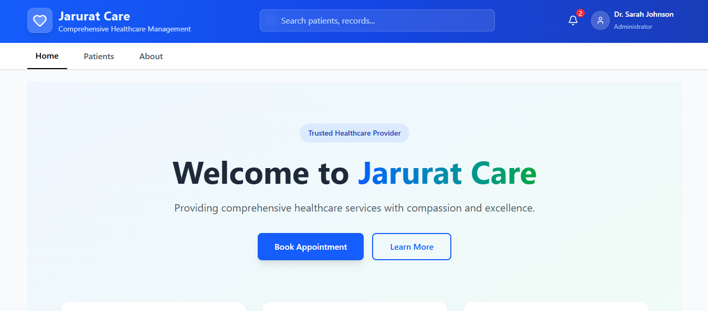

# Jarurat Care - Patient Records Dashboard

A modern, responsive Patient Records Dashboard built with React, Vite, and Tailwind CSS. This application helps healthcare providers manage patient records efficiently.


## Features

- 📋 Manage patient records
- 🔍 Real-time search functionality
- 📱 Fully responsive design
- ➕ Add new patients
- 👁️ View patient details in modal
- 🎨 Modern UI with Tailwind CSS
- ⚡ Fast development with Vite

## Live Demo : https://jarurat-care-assignment-seven.vercel.app/

## Screenshots



## Technology Stack

- **Frontend Framework:** React 18
- **Build Tool:** Vite
- **Styling:** Tailwind CSS
- **Icons:** Lucide React
- **Deployment:** Vercel

## Getting Started

### Prerequisites

- Node.js (v14+)
- npm or yarn package manager

### Installation

```bash
# Clone the repository

git clone https://github.com/your-username/jarurat-care.git
cd jarurat-care

# Install dependencies
npm install

# Start development server
npm run dev

